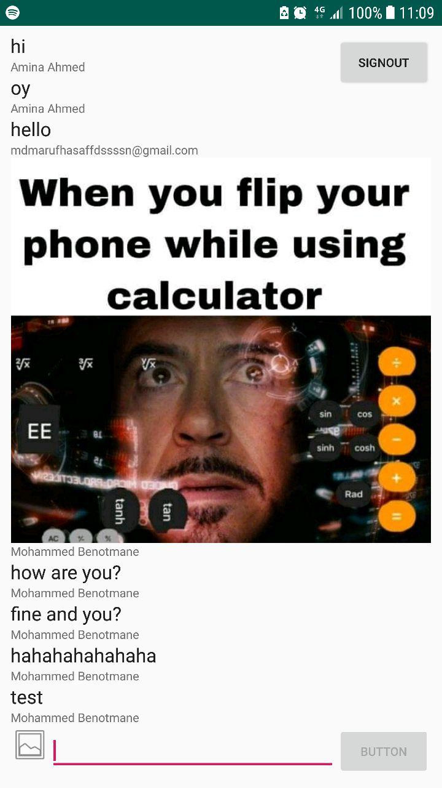

# Chat-Application

## Description:
this is an android Chat Application using FireBase

## ScreenShot:

## Tools & languages:
* Android Studio
* Java
* XML
* FireBase

## Contribution:
Feel free to fork this project and add whatever you like. If you have any suggestions or any comments please feel free to contact me or to open an issue, use free license art assets please.

## Team:
[Jetlighters](https://github.com/JetLightStudio) having fun.

### Tutorial Link:
[Udacity Course](https://classroom.udacity.com/courses/ud0352)
